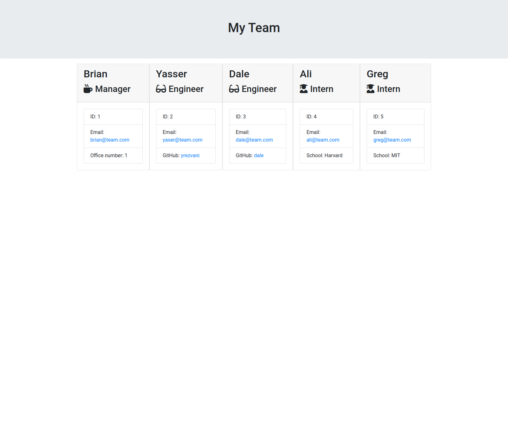

# Employee information app

This app lets you input your employees' information and generates a HTML file that dispalys your employees' information. Every employee is displayed in a nicely formatted card with an icon representing the role of the employee. Each card contains basic emloyee information and adds some additional information for interns, engineers and managers.

## Screenshot

## Usage

In order to use the app, you need to enter "node index.js" in the terminal. You will then get a series of prompts on the screen about your employees. Once you have answered the prompts, your html file will be generated based on your answers.

## Github repository

https://github.com/yrezvani/employee-info-app 

